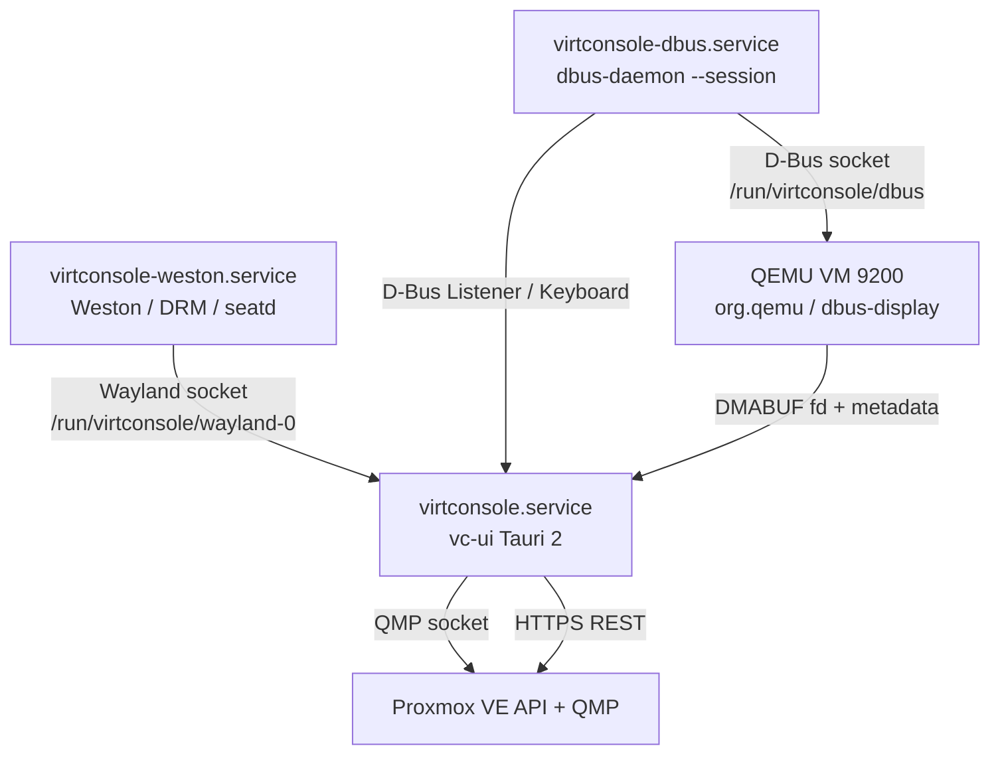

# 架构总览

> - 类型：规范（长期有效）
> - 权威范围：本文是**模块边界、数据流、服务拓扑、配置项、IPC 命令清单**的唯一来源。
>   采集与输入的协议细节见 [21-采集与输入.md](21-采集与输入.md)；前端内部结构见 [31-前端架构.md](31-前端架构.md)
> - 最后核实：2026-08-19（对照当前真机 VM 9200 与仓库工作树）

## 当前真机架构（2026-08-19）

下面是 VM 9200 当前实验配置的实际数据流。默认的 Canvas 像素链路仍保留，
但真机当前通过 systemd 临时 override 启用了 DMABUF 显示和 HID 鼠标。

```mermaid
flowchart LR
    subgraph VM[Win10 VM 9200]
        W[Windows 桌面]
        VG[virtio-vga-gl / virgl]
        IL[input-linux 相对鼠标设备]
        W --> VG
        IL --> W
    end

    subgraph Q[宿主 QEMU 11]
        D[dbus-display\ngl=on]
        R[rendernode=/dev/dri/renderD128]
        E[evdev=/dev/input/by-id/...if01-event-mouse]
        VG --> D
        R --> D
        E --> IL
    end

    subgraph H[宿主 Linux]
        BUS[virtconsole-dbus.service\n/run/virtconsole/dbus]
        L[vc-ui Rust\nScanoutListener]
        O[native Wayland DMABUF overlay\nlinux-dmabuf + subsurface]
        WV[WebView / React UI\n键盘、导航、Canvas 回退]
        APP[vc-ui Rust / Tauri IPC]
        WS[virtconsole-weston.service\nWeston DRM + kiosk-shell]
        HDMI[HDMI 输出]
        M[/dev/input/event5\nTexas Instruments Mouse]
        K[宿主键盘\nWebKit KeyboardEvent]
        P[PVE REST / QMP / PTY / 浏览器]
        BUS --> D
        D -- ScanoutDMABUF / UpdateDMABUF --> L
        L --> O
        O --> WS --> HDMI
        M --> E
        K --> WV
        WV -->|Tauri IPC| APP
        APP --> L
        P --> WV
    end

    style O fill:#d9f2e6,stroke:#238636
    style IL fill:#fff2cc,stroke:#b8860b
    style WV fill:#e8f0fe,stroke:#3367d6
```

### 当前路径与回退路径

| 子系统 | 当前真机实验路径 | 默认/回归路径 | 关键边界 |
|---|---|---|---|
| 画面采集 | `gl=on` → `ScanoutDMABUF` → native Wayland overlay → Weston | `gl=off` → `Scanout/Update` → Rust RGB → `vm-frame` → WebView Canvas | DMABUF 模式不发送 Base64 像素帧 |
| 鼠标 | `/dev/input/event5` → QEMU `input-linux` → Win10 相对 HID | Canvas 坐标 → `capture_mouse_move/button` → D-Bus Mouse | HID 模式禁止第二套绝对坐标注入 |
| 键盘 | WebView `KeyboardEvent.code` → `input.rs` → D-Bus Keyboard | D-Bus 不可用时回退 QMP `input-send-event` | `Ctrl+Alt+Q` 由宿主前端拦截，不进 VM |
| 显示合成 | Weston `zwp_linux_dmabuf_v1` + `wl_subsurface` | WebView Canvas 由 Weston 合成 | DMABUF fd 不经 EGL、不经 QMP 截图 |
| VM 管理 | PVE REST（状态/配置/动作） | 同左 | QMP socket 由 Rust 串行复用 |

### 进程、服务与接口关系



### 代码模块对应

```text
ui/src/lib.rs
├── commands/capture.rs       IPC 入口；HID 模式屏蔽旧鼠标注入
├── capture/session.rs        D-Bus Listener、DMABUF 生命周期、采集任务
├── capture/overlay.rs        native Wayland DMABUF overlay
├── capture/dbus_input.rs     D-Bus Keyboard/Mouse 协议调用
├── input.rs                  键盘 sink：D-Bus 优先，QMP 回退
├── qmp.rs                    QMP 连接、screendump 和输入回退
├── pve.rs                    PVE REST 客户端
└── terminal.rs / browser.rs  宿主 PTY 与独立 WebView 标签

ui/web/src/console
├── ConsoleLayer.jsx          采集会话生命周期、沉浸层和退出热键
├── useFrameStream.js          Canvas 像素回归路径 + vm-display-size 元数据
└── useInputForward.js         键盘及默认鼠标 IPC；HID 模式不发鼠标事件
```

### 当前实验开关

| 开关 | 当前值 | 作用 |
|---|---:|---|
| `VIRTCONSOLE_DMABUF_WAYLAND` | `1`（真机临时 override） | 启用 native Wayland DMABUF overlay |
| `VIRTCONSOLE_HID_MOUSE` | `1`（真机临时 override） | 前端停止绝对鼠标 IPC，使用 QEMU `input-linux` |
删除 `VIRTCONSOLE_DMABUF_WAYLAND` override 即可回到默认像素链路；旧 EGL 与 ScanoutMap
方案已移除，历史结论见 [archive/废弃方案.md](archive/废弃方案.md)。

## 一、进程与服务拓扑

真机上由三个 systemd 服务组成，无桌面会话、无容器：

```text
开机
 ├─ virtconsole-dbus.service       dbus-daemon（共享 D-Bus 总线）
 ├─ virtconsole-weston.service     Weston（DRM 后端 + kiosk-shell）
 │                                 以系统用户 virtconsole 经 seatd 运行
 │                                 显式 --socket=wayland-0
 └─ virtconsole.service            vc-ui（Tauri 2 应用）
                                   ExecStartPre 等总线与 Wayland socket 就绪
```

vc-ui 进程内部：

```text
vc-ui
├── Rust 主进程
│   ├── WebView（WebKitGTK）      加载 ui/dist 静态产物
│   ├── 采集任务（tokio）          模式 1 轮询 / 模式 2 D-Bus Listener
│   ├── PTY 子进程                 宿主 bash
│   └── QMP 连接（单条，Mutex 串行化）
└── 浏览器标签 = 独立 Webview 窗口（每标签一个）
```

## 二、Rust 侧模块边界

| 模块 | 职责 | 关键约束 |
|---|---|---|
| `lib.rs`（141 行） | 只做装配：模块声明、State 注册、`invoke_handler` | 不放业务逻辑 |
| `commands/` | IPC 命令，**按 State 依赖分文件**（一文件对应一个 `manage` 的 State） | 见 §四 |
| `capture/` | 模式 2 采集：`session`（生命周期）/ `frame`（帧与差分）/ `keymap`（scancode）/ `dbus_input`（键鼠下发）/ `mod`（出口） | `keymap`、`frame` **不挂 `cfg(unix)`**，见下 |
| `input.rs` | 输入路由：选 sink（D-Bus 可用走 D-Bus，否则回退 QMP） | 与 `capture/dbus_input.rs` 职责不同，勿混 |
| `qmp.rs` | 模式 1 采集 + QMP 输入 | QMP socket 单客户端，须共用一条连接 |
| `pve.rs` | PVE REST 客户端，含 `mock://` 后端 | Mock 忠实复刻真实 PVE 行为 |
| `terminal.rs` | 宿主 PTY 会话，stdout→事件 / stdin←IPC | 进视图建会话，退出即销毁 |
| `browser.rs` | 多 Webview 标签管理（open/close/focus/back/forward） | 每标签独立窗口 |
| `config.rs` | `config.json` 持久化 | 字段见 §五 |
| `testmode.rs` | `VIRTCONSOLE_TEST` 测试模式与 120s 看门狗 | 见 [40](40-测试规范.md) |

### 为什么 `keymap` 与 `frame` 不挂 `cfg(unix)`

两者是纯计算（查表、像素偏移、脏区包围盒），没有 fd 与 socketpair。
挂 gate 等于宣布它们在 Windows 开发机上永远编不到、测不了 —— 提交 `f173f50`
的「方向键全错」正是这么漏到真机的。

为此 `session.rs` 必须单独成文件（原方案写四个文件），
否则 session 的 `cfg(unix)` 会连带 gate 掉整个 `mod.rs`。
Windows 上这些符号无消费者，用 `#![cfg_attr(not(unix), allow(dead_code))]` 消警告。

## 三、数据流

### 画面

```text
当前真机：VM ──ScanoutDMABUF──→ capture/session.rs
       ──linux-dmabuf fd──→ capture/overlay.rs
       ──wl_subsurface──→ Weston ──→ HDMI

默认回归：VM ──D-Bus Scanout/Update──→ capture/frame.rs ──→ RGB
       ──base64 vm-frame 事件──→ 前端 Canvas

低频回退：VM ──QMP screendump──→ qmp.rs ──PPM 解析──→ RGB / Canvas
```

DMABUF 模式与像素回归模式的数据形态不同：前者只向前端发送尺寸元数据，
后者发送 RGB 像素；因此两者不能在同一会话中同时绘制同一块客户机画面。

### 输入

```text
前端 KeyboardEvent.code ──IPC──→ input.rs 选 sink
                                   ├── input_bus + console_path 都在 → D-Bus Keyboard/Mouse
                                   └── 否则 → QMP input-send-event
```

**前端只发 `KeyboardEvent.code`，走哪条路由后端决定。** 前端不做分支判断
（历史上前端的 `if (e.code)` 回退分支是死代码，已删除）。

### PVE 数据

```text
前端 ──IPC──→ commands/pve.rs ──→ pve.rs ──HTTPS REST──→ PVE API
                                    └──→ mock:// 内置固定 JSON（离线开发与测试）
```

## 四、IPC 命令清单

命令按 State 依赖分文件。**`app.rs` 把应用信息与测试模式放在一起**，
因为 `test_report` 直接决定进程退出码，属同一套 harness 管线。

| 文件 | 命令 |
|---|---|
| `app.rs` | `app_info` `boot_vmid` `test_mode` `test_suites` `test_report` |
| `vm.rs` | `vm_connect` `vm_disconnect` `vm_input_key` `vm_input_text` `vm_status` |
| `capture.rs` | `capture_start`¹ `capture_stop`¹ `capture_status`¹ `capture_input_ready` `capture_input_key` `capture_input_text` `capture_mouse_move`¹ `capture_mouse_button`¹ |
| `config.rs` | `get_config` `set_theme` `set_ui_scale` `set_capture` `set_autoconnect` `set_pve_config` |
| `pve.rs` | `pve_connect` `pve_entities` `pve_vm_detail` `pve_vm_action` `pve_snapshots` `pve_snapshot_create` `pve_snapshot_rollback` `pve_snapshot_delete` `pve_vm_enable_dbus` `pve_vm_disable_dbus` `pve_host_live` `pve_host_rrd` `pve_vm_live` `pve_vm_rrd` `pve_gpu_metrics` |
| `term.rs` | `term_start` `term_stop` `term_input` `term_resize` |
| `browser.rs` | `browser_open` `browser_close` `browser_close_all` `browser_focus` `browser_back` `browser_forward` `browser_exit` |

¹ 挂 `cfg(unix)`。**输入三件套（`capture_input_ready/key/text`）两平台都注册**——
此前 `cfg(unix)` 让非 unix 拿到「命令不存在」而非输入层错误，掩盖了真实问题。

### Rust → 前端事件

| 事件 | 载荷 |
|---|---|
| `vm-frame` | 帧数据（base64 RGB），含 full / dirty 类型 |
| `vm-status` | VM 连接与运行状态 |
| `pve-status` | PVE 连接状态 |
| `term-out` | PTY stdout |
| `browser-tabs` | 标签列表变化 |
| `browser-exit` | 浏览器退出信号 |

## 五、配置项（`config.json`）

路径：`~/.config/com.virtconsole.app/config.json`（真机为 `/root/.config/...`）

| 字段 | 取值 | 说明 |
|---|---|---|
| `theme` | `dark` / `light` / `system` | 主题，切换即时生效 |
| `ui_scale` | `auto` / `0.9` / `1.0` / `1.1` / `1.25` | **缩放倍率**（V3.0 语义变更，旧值 `720p/1080p/2k/4k` 迁移为 `auto`） |
| `capture_fps` | 5 / 10 / 15 | 模式 1 轮询间隔 |
| `capture_scale` | 原始 / 适配屏幕 / 自定义 | VM 画面到 Canvas 的缩放策略（信箱模式） |
| `autoconnect_vmid` | VMID 或空 | 开机直连，替代环境变量 |
| `pve.method` | `token` / `password` | 鉴权方式 |
| `pve.host` `pve.node` | 字符串 | PVE 地址与节点名 |
| `pve.token` | 字符串 | API Token（method=token 时） |
| `pve.username` `pve.password` | 字符串 | 账号密码（method=password 时） |

## 六、环境变量

| 变量 | 作用 |
|---|---|
| `VIRTCONSOLE_MOCK=1` | 跳过 GPU / Wayland 环境自检（开发机） |
| `VIRTCONSOLE_TEST=1` | 测试模式：加载测试驱动 + 120s 看门狗 + 退出码 |
| `VIRTCONSOLE_TEST_SUITES` | 逗号分隔套件 id，缺省 `*` |
| `VIRTCONSOLE_VMID` | 指定采集目标（`host` crate 用） |
| `VIRTCONSOLE_AUTOCONNECT_VMID` | 开机直连（已被 config 的 `autoconnect_vmid` 取代） |
| `VIRTCONSOLE_BROWSER_AUTOOPEN` | 浏览器自动开标签（验证钩子） |
| `VIRTCONSOLE_DMABUF_WAYLAND=1` | 真机实验：Wayland 直接提交 DMABUF |
| `VIRTCONSOLE_HID_MOUSE=1` | 真机实验：鼠标由 QEMU `input-linux` 接管 |

## 七、启动前环境自检

`environment::check()`（`host` crate）与 `scripts/check.sh` 各覆盖一半：

| 检查 | 失败时行为 |
|---|---|
| Wayland 会话缺失 | 提示检查 Weston 服务，正常退出（**不崩溃**） |
| GPU 缺失（`/dev/dri` 无 `card*`/`renderD*`） | 列出排查步骤并退出 |
| 单卡直通后宿主无 GPU | 同上（被 GPU 检查拦截） |

`VIRTCONSOLE_MOCK=1` 跳过全部校验。Windows 下自动进入 Mock。

## 八、关键架构约束（改代码前必读）

1. **QMP socket 同一时刻只允许一个客户端**。采集与输入必须共用一条连接，
   Rust 侧用 `tokio::Mutex` 串行化。
2. **采集模式由 VM 配置决定，不可运行时热切换**。改模式需改 VM 配置并重启 VM。
3. **QMP 不接受 `"arguments": null`**，无参数命令必须省略该字段（Mock 测不出，真机才暴露）。
4. **PVE 的 `GET /nodes/{node}/qemu/{vmid}` 返回子目录列表**，真正的配置端点是 `/qemu/{vmid}/config`。
5. **PVE 的 `memory` 字段是字符串**（`"2048"`），须兼容数字/字符串解析。
6. 前端是静态资源，由 tauri-build 编译时嵌入。改前端后行为没变，
   `touch ui/src/lib.rs` 或重新 `cargo build -p vc-ui` 强制重嵌。
