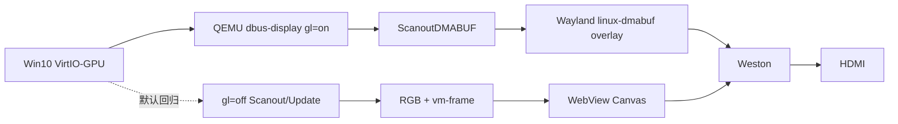

# 废弃方案记录

> 本目录记录已经从当前项目结构移除的实现、回退代码和实验入口。
> 这些记录只说明历史决策，不是可执行规范；旧结论的完整时间线仍见
> [../90-历史记录.md](../90-历史记录.md)，决策表仍见 [../91-决策记录.md](../91-决策记录.md)。

## 2026-08-19：删除旧前端 `ui/frontend/`

- **原用途**：V3.0 React 前端迁移期间的纯 HTML/CSS/JS 回退实现。
- **删除原因**：`ui/web/` 已成为唯一构建入口，Tauri 的 `frontendDist` 指向 `ui/dist/`；旧目录不再构建、部署或测试，继续保留会造成两个前端行为漂移。
- **替代实现**：`ui/web/`（Vite + React 19）及 `ui/web/src/test/` 测试套件。
- **恢复方式**：不恢复旧目录。若需要研究历史行为，使用 Git 历史中的 P5 前提交；不得重新把 `frontendDist` 指向旧目录。

## 2026-08-19：删除 vc-ui 内的 `ScanoutMap` 生产接入

- **原用途**：`VIRTCONSOLE_SCANOUT_MAP=1` 下注册 `org.qemu.Display1.Listener.Unix.Map`，mmap QEMU 共享内存，再复制到 GTK native staging overlay。
- **验证结论**：QEMU 能发送 `ScanoutMap/UpdateMap`，fd 和 mmap 生命周期可控；但该路径是主机侧复制的 GTK staging，不是直接 `wl_shm` 零拷贝，而且与当前已通过的 DMABUF Wayland overlay 重复。
- **删除原因**：当前生产目标是 QEMU DMABUF 直接交 Weston；Map 路径增加一套 Listener、帧缓冲和 GTK overlay 状态，未提供更好的端到端结果。
- **替代实现**：`gl=on` + `ScanoutDMABUF/UpdateDMABUF` + `capture/overlay.rs` 的 native Wayland overlay；默认回归仍保留 `gl=off` + `Scanout/Update` + Canvas。
- **探针结论**：Map 探针的通过/失败记录保留在历史文档中，不再作为仓库运行入口。

## 2026-08-19：删除旧 EGL DMABUF 生产开关

- **原用途**：`VIRTCONSOLE_DMABUF=1` 尝试让宿主 EGL 导入 QEMU DMABUF，再由应用自行渲染。
- **验证结论**：NVIDIA 私有 modifier 在 `eglCreateImageKHR` 中返回 `EGL_BAD_MATCH`；WebView Canvas 也不能直接消费 EGLImage。
- **删除原因**：该入口只能制造一个明确失败的运行模式，不能提供显示回退。
- **保留内容**：`spike-dbus` 的严格 EGL 探针和报告工具仍保留，用于驱动/QEMU 升级后的重新评估；它不会被 `vc-ui` 生产链路调用。

## 当前保留的显示路径

